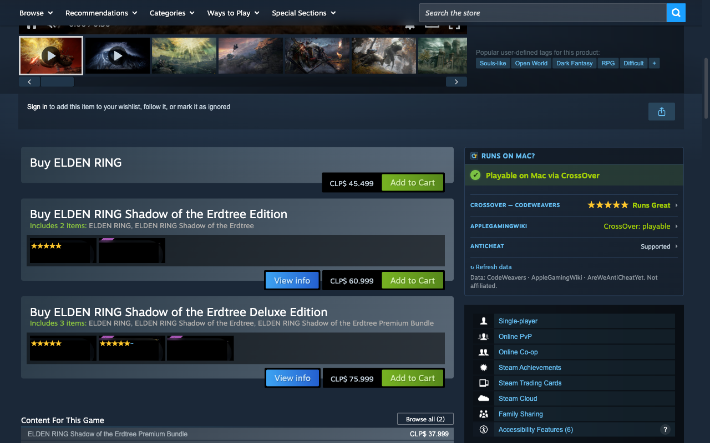
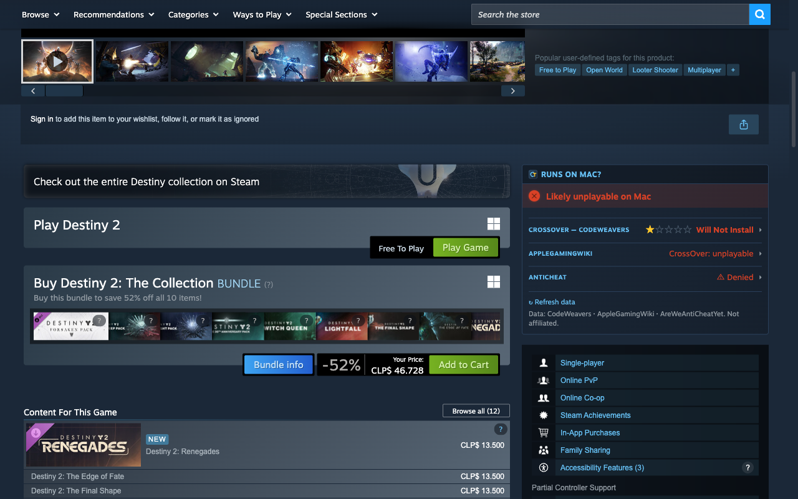
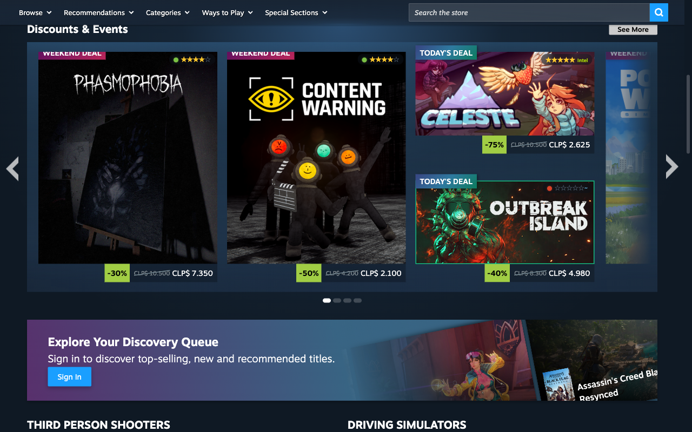
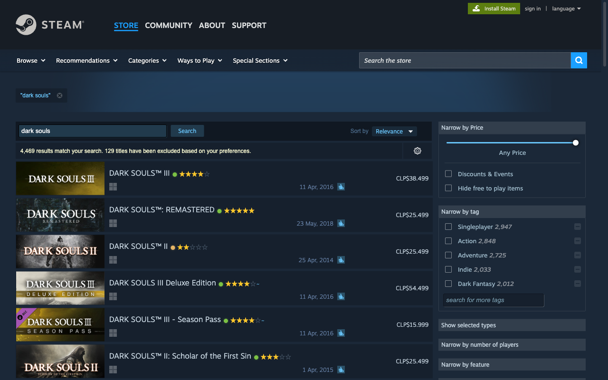
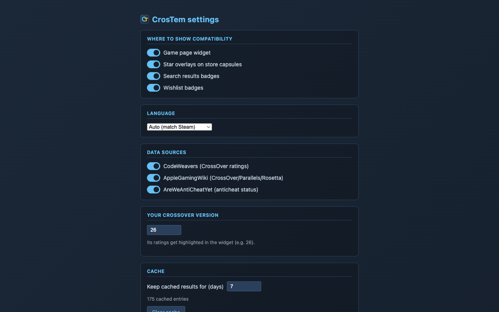
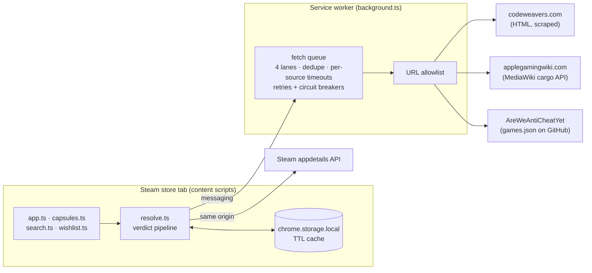

<div align="center">


# CrosTem

**"Does it run on my Mac?" — answered right on the Steam store.**

[](https://github.com/s2c52/CrosTem/actions/workflows/ci.yml)
[](CHANGELOG.md)
[](LICENSE)
[](manifest.json)
[](tests/)
[](public/_locales/)
[](package.json)

*A browser extension (Chromium, Manifest V3) by Sacha Gennari — [s2c52](https://github.com/s2c52)*

</div>



## What is CrosTem?

Steam says "Windows only" for most of its catalog — but a huge share of those games run beautifully on a Mac through [CrossOver](https://www.codeweavers.com/crossover), Parallels or Rosetta 2. The catch: finding out *which ones* means juggling three different community databases in separate tabs, every time you browse the store.

CrosTem folds all of that into Steam itself. Every game page gets a **"Runs on Mac?" verdict** — a conservative traffic light (🟢🟡🔴) computed from three community sources — plus star overlays on capsules across the whole store, and badges in search results and your wishlist. No accounts, no servers, no telemetry: the extension only fetches public compatibility pages and caches them in your browser.

## The three sources

| Source | What it contributes |
|---|---|
| [CodeWeavers CrossOver database](https://www.codeweavers.com/compatibility) | Official CrossOver compatibility ratings ("Runs Great"…), stars, last-tested version and a per-version breakdown |
| [AppleGamingWiki](https://www.applegamingwiki.com/) | Community status for CrossOver, Parallels, Rosetta 2 and native macOS builds |
| [Are We Anti-Cheat Yet?](https://areweanticheatyet.com/) | Anti-cheat support status — the #1 blocker for multiplayer games under CrossOver (Linux/Proton data, indicative) |

Steam's own same-origin `appdetails` API supplies the native-macOS flag and game metadata — native games are flagged directly, no external lookups needed.

## How the verdict works

The verdict engine ([src/lib/verdict.ts](src/lib/verdict.ts)) is a pure, fully-tested function with a deliberately **conservative** policy:

| Verdict | Meaning | When |
|---|---|---|
| 🟢 | Playable on Mac via CrossOver | CodeWeavers ≥ "Runs Well" (or ≥ 4★) **or** AppleGamingWiki ≥ *playable* — with no bad signal from the other source and no anti-cheat problem |
| 🟡 | Playable with caveats | Mixed or intermediate signals, or anti-cheat support merely *Planned* |
| 🔴 | Likely unplayable on Mac | Anti-cheat *Denied* or *Broken* (always forces red), or only negative compatibility signals |
| ⚪ | No compatibility data | Neither CodeWeavers nor AppleGamingWiki knows the game |

When the sources disagree, the widget says so explicitly ("Sources disagree — check both before buying") and shows each source's raw status so you can judge for yourself.



## Features

CrosTem renders on six surfaces, all individually toggleable:

- **Game-page widget** — a "Runs on Mac?" panel in the right column: verdict banner, collapsible per-source rows, the 3 latest CrossOver versions with stars (your branch highlighted), last-tested version, and direct links to each source. Skeleton shimmer while loading, retry on error.
- **Store-wide capsule overlays** — star ratings in the corner of game capsules everywhere (front page, sales, categories, "more like this"…), resolved lazily as each capsule scrolls into view. `?` marks games with several possible matches; `~` marks approximate matches.
- **Search results & wishlist badges** — compact rating badges next to each row's title, injected as rows appear (MutationObserver for Steam's AJAX search, generic `/app/` link detection for the React wishlist SPA).
- **Toolbar popup** — the active tab's verdict at a glance, manual game lookup, quick surface toggles and cache stats.
- **Options page** — toggle each surface and data source (changes apply live to open Steam tabs), set your CrossOver version, tune the cache TTL (1–30 days), and export/import your match corrections.
- **Hover tooltip & onboarding** — a mini-card with the verdict and per-source lines on badge hover, and a one-time onboarding page after install.

<table>
<tr>
<td width="50%"></td>
<td width="50%"></td>
</tr>
<tr>
<td align="center"><em>Star overlays across the store</em></td>
<td align="center"><em>Badges in search results</em></td>
</tr>
</table>

Plus:

- **Native macOS games** get a "Native on macOS" badge with 5 stars and an architecture tag — **M Series (Apple Silicon)** vs **Intel (Rosetta 2 on M)** — detected from AppleGamingWiki, Steam system requirements or release date ([src/lib/arch.ts](src/lib/arch.ts)), without querying CodeWeavers at all.
- **Ambiguous-match resolution** — when a Steam name doesn't clearly map to a single CodeWeavers entry, the widget shows the candidates; pick once and CrosTem remembers it for that game everywhere ("Wrong match?" to change it). Corrections are kept per source and can be exported/imported.



## Install

**Chrome Web Store:** coming soon.

**From source** (Chrome, Brave, Edge — any Chromium browser):

```bash
git clone https://github.com/s2c52/CrosTem.git
cd CrosTem
npm install
npm run build      # typecheck + vite build → dist/
```

Then open `chrome://extensions` (or `brave://extensions`), enable **Developer mode**, click **Load unpacked** and select the generated **`dist/`** folder.

## 30 languages

The injected UI follows the **language of the Steam page you're viewing** — not the browser's — in all 30 languages Steam supports, detected from Steam's own page config (with `?l=` and the `Steam_Language` cookie as fallbacks; [src/lib/steam-lang.ts](src/lib/steam-lang.ts)). Statuses quoted from the sources ("Runs Great", "playable"…) are intentionally left untranslated: they are citations, not UI copy.

## How it works



- **CodeWeavers has no public API**, so the extension fetches their public pages (`/compatibility?name=…` to search, `/compatibility/crossover/<slug>` for detail) and parses the HTML with `DOMParser`. All scraping lives in one file: [src/lib/parser.ts](src/lib/parser.ts).
- **The service worker proxies every external fetch** — content scripts can't cross origins (CORS), the worker can via `host_permissions`. It enforces a strict, unit-tested **URL allowlist** ([src/lib/allowlist.ts](src/lib/allowlist.ts)): only the three sources' public endpoints, nothing else. Four concurrent lanes with in-flight deduplication, per-source timeouts (5–15 s under `AbortController`), retries with exponential backoff honoring `Retry-After`, and **per-origin circuit breakers** ([src/lib/breaker.ts](src/lib/breaker.ts)) so a slow or downed source fails fast instead of hanging badges — which then degrade to whatever the other sources report.
- **Everything is cached** in `chrome.storage.local`: results for 7 days (configurable 1–30), "no data" answers for 24 h, Steam details for 30 days, the anti-cheat dataset for 7 days — and your match choices permanently. Reads go **stale-while-revalidate**: a recently expired entry paints instantly while a background pass refreshes it and silently corrects the badge if anything changed. The cache maintains itself (in-memory L1, daily sweep, quota-safe writes, size-capped eviction). Settings live in `chrome.storage.sync` and apply **live**: toggling a surface mounts or unmounts it immediately on open Steam tabs, no reload.
- **Badges resolve ahead of time**: a shared `IntersectionObserver` ([src/lib/auto.ts](src/lib/auto.ts)) triggers resolution about a viewport before a capsule scrolls into view, paints on the first source signal and refines when the rest arrive — while content scripts rescan only newly added page content ([src/lib/scan.ts](src/lib/scan.ts)), so browsing the front page stays cheap.
- **No `innerHTML` anywhere** — all UI is built with `createElement`/`createElementNS`, safe under strict CSP and Trusted Types. Accessible by design: star ratings carry `role="img"` labels, verdicts are never conveyed by color alone, and `prefers-reduced-motion` is honored.

## Privacy

- The only Chrome permission is **`storage`**. No `tabs`, no history, no cookies.
- Requests go exclusively to the four hosts above — Steam (the page you're already on), CodeWeavers, AppleGamingWiki and AreWeAntiCheatYet's public dataset.
- No telemetry, no accounts, no servers of ours. Full policy: [docs/privacy-policy.md](docs/privacy-policy.md) ([español](docs/privacy-policy.es.md)).

## Development

```bash
npm install
npm run dev            # vite in watch mode (reloads the extension on save)
npm run build          # typecheck + vite build → dist/
npm test               # 241 unit tests (vitest + happy-dom, real HTML fixtures)
npm run lint           # eslint
npm run e2e            # Playwright against the real Steam store (headed Brave; E2E_HEADLESS=1 for CI)
npm run package        # minified release build + zip for the Chrome Web Store
```

The verification gate is `scripts/verify.sh` (typecheck + lint + tests + build); CI on GitHub Actions runs the same on every push (Node 22), audits dependencies and uploads `dist/` as an artifact. The e2e suite also runs in CI on pull requests to `development` as a **non-blocking** job (headless Chromium; real Steam is too flaky for a gate) — the headed run before each release remains the authoritative check.

See [CONTRIBUTING.md](CONTRIBUTING.md) if you want to help, and [SECURITY.md](SECURITY.md) for reporting vulnerabilities.

### If CodeWeavers changes their HTML

All scraping lives in [src/lib/parser.ts](src/lib/parser.ts) (selectors: `#teTable-app` for search; `#appRating .os_Mac` and `#breakdown .breakdown-row` for the detail page). The tests in [tests/parser.test.ts](tests/parser.test.ts) will fail with new fixtures — the header comment explains how to recapture them.

## License

The source code is licensed under the **GNU General Public License v3.0 or later** — see [LICENSE](LICENSE). You are free to use, study, modify and redistribute it, provided derivative works remain under the same license.

**Name and logo are not covered by that license.** The "CrosTem" name and the extension icon are reserved by the author: forks and derivative distributions must use a different name and icon so users can tell them apart from the original extension.

The HTML files under `tests/fixtures/` are captures of public pages from codeweavers.com, included solely as test fixtures; their content belongs to their respective owners and is not covered by the project license.

## Data sources and attribution

CrosTem displays data from these third-party sources, credited with thanks:

- [CodeWeavers CrossOver compatibility database](https://www.codeweavers.com/compatibility) — CrossOver ratings and version breakdowns.
- [AppleGamingWiki](https://www.applegamingwiki.com/) — macOS compatibility data (CrossOver, Parallels, Rosetta 2, native).
- [Are We Anti-Cheat Yet?](https://areweanticheatyet.com/) — anti-cheat status data.
- [Steam appdetails API](https://store.steampowered.com/) — platform flags and game metadata.

## Disclaimer

CrosTem is an independent project. It is **not affiliated with, endorsed by, or sponsored by** Valve Corporation (Steam), CodeWeavers (CrossOver), AppleGamingWiki, Are We Anti-Cheat Yet?, or Apple. All trademarks are the property of their respective owners. Compatibility ratings are community-reported data and carry no guarantee that a given game will work.
